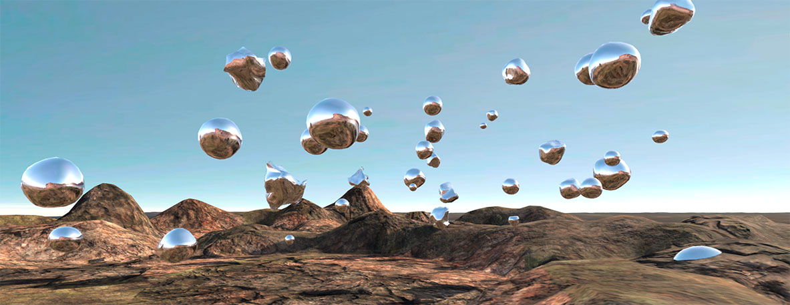

# ANDEAN RITUS
by Simon Stimberg  
Orientation Project - Master Creative Technologies - Winter Term 2018/19

> **Andean Ritus** shall be a *Visual Music Experience* in Virtual Reality, wherein a psychedelic transformation from the real to the surreal can be experienced spatially and interactive via music and equivalent visual elements.

## Setup
To be able to run the project, Unity v2017, Max 8 and JAVA Runtime Environment are required to be installed.  
1. Clone or download this reposity.
2. Install/Set all Dependencies/Configurations as stated under [Dependencies](Dependencies/).

## LogFile
Under [LogFile.md](LogFile.md) you will find a kind of log book (or maybe project diary) that reflects my process on working on this project.

## Scripts Overview / Credits

### UNITY

#### TriggerMaster.cs
* this is the heart of the project where most of the event handling is taking place and where the game logic lives.  
*  except where stated it was completely written by myself. 

#### OSCManager.cs
* handles all the incoming and outgoing OSC messages  
* based on the script from this tutorial:  
  https://www.uni-weimar.de/kunst-und-gestaltung/wiki/GMU:Tutorials/Visual_Interaction/How_to_Control_Unity_with_MaxMsp  
* but I had to translate it from Javascript to C#, because communication between scripts in different languages are tricky till impossible in Unity. (because they are compiled at different stages.)  

#### NoiseDeformer.cs
* a script using perlin noise to distort the spheres  
* slightly changed version, based on the script from the tutorial mentioned above.  
  also I had to rewrite it in C#

#### IcoSphere.cs + GenerateNewPlanet.cs
* a script to generate ico spheres which behave more smooth while being distorted than the unity sphere's primitive mesh  
* based on a script from this forum post:  
  https://gamedev.stackexchange.com/questions/166468/how-do-i-generate-a-sphere-mesh-in-unity  
* edited the script to fit the needs of the project (spheres can be created generatively and have attributes to address them, as well as attaching the distortion script to them)

#### Ripple.shader + RipplePostProcessor.cs
* to create a ripple/distortion effect on the camera - based on this tutorial:  
  http://blog.onebyonedesign.com/unity/unity-ripple-or-shock-wave-effect/  
* edited the shader and the script to being able to be manipulated at runtime

#### Distortion.shader + ShaderManipulator.cs
* a distortion shader to that is placed on a transparent cylinder inside the unity scene to distort the the environment visually  
* created the shader with help from this tutorial:  
  http://tinkering.ee/unity/asset-unity-refractive-shader/  
* created a script that controls and manipulates the shader at runtime, that it can be stimulated in sync

### MAX/MSP
* the binaural panner / spatializer used in the patch is based on the java external by:  
  http://jakobhandersen.dk/projects/fft-based-binaural-panner/download/