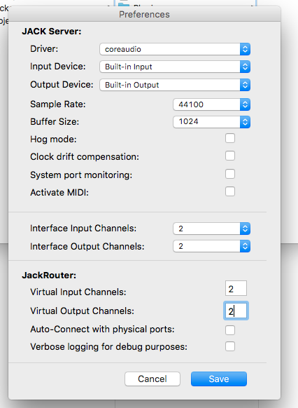

# LogFile Orientationproject: Andean Ritus (AT) #
 

### 4. April 2019

#### Max: build a new Note Generator
that creates notes based on the input from unity (creation of spheres)  
up to 64 notes possible (4 Synth voices * 16 sequencer steps)  
the 4 synths play in 4 octaves  

stores the spatial position in a coll-object  
with the note only the number of the corresponding object is stored into the sequencer (as extra1 value)  
recalls the data when the corresponding sound is played  
and send the number of sound to unity to trigger the corresponding object  

#### Max: adapted OSC-handling
now there is one object sending all the note events to unity  
sending the corresponding object number + pitch and velocity value

adapted the receiver and the spatializer

#### Unity: rewrote NoiseDeform javascript in C#
based on similar script found in the web  
* saved as PerlinAnimateMesh in Script BackUps folder  
* source (forum post) can be found: just google "perlin noise deform unity c#"  
had to rewrite because awkward communication problems between c# and js scripts  

now the noise script is attached to every new object  
if the noise value is increased by another script it lerps back to idle state  

#### Unity: adapted the OSC-Manager
to handle all incoming/outgoing signals  
INTERESTING: from the message handler function its not possible to send to/feed the other scripts  
(apparently, because it isnt running in the main thread, but on a level of initialisation  
therefore it only works via updating global variables  
and in the update function it has to check whether there are new values and distribute them from this position

updated TriggerMaster as well to handle all the triggering

 

### 3. April 2019

#### Unity: rewrote the OSC-Receiver Script in C#
a loooot of hassle but finally it worked  
receiving as well as sending  
fortunately could rewrite the existing lite script, rather than using the heavy Touch OSC cs library  
had to correct NoiseTransform as well  

stored the old scripts in a backup folder in Unity-Projects  
look at the old OSCReceiver.js for how things were handled before  

#### Max: Store position information in list
use coll object to store things  
read max tutorial no. 18 for deeper information  

 

### 2. April 2019

#### Max

made a prefab patch for random note generation  
introduced 4 voices in different octaves - all controlling an additive synth (maybe just use the additive ones?)  
checked longer loop steps (64, 32) but conclusion: not so nice  
made a prefab for the positioning and OSC handling  

made a snapshot of better drum settings  

#### Unity: Trigger-Script
wrote a script that triggers the creation of a new Mercury Sphere  
* depending on a minimun time that has to pass  
* and on the condition, that the velocity of the camera rotation measured over a certain time is below a certain level  
  found helpful code here: https://forum.unity.com/threads/manually-calculate-angular-velocity-of-gameobject.289462/  
  (used the code by BenZed (answer #18) - while #20 got a lot upvotes > could be checked if improvement is desired)
  
  
the position of the new object is in the opposite direction of the viewing direction +/- 90° (randomly)  
within a minimum radius distance to the viewers position (+ a bit random)  

-> next step: feed max with the data and trigger a corresponding sound

 

### 1. April 2019

#### Testing in VR

Works without SteamVR Asset installed (only VR turned on under Player Settings)

Audio Spatialization
* if one sequencer all 360° all around the viewer -> super confusing and disturbing + you wont see the object, because its disappeard before your eyes can follow your ears.
* -> best to keep every synth locally restricted to an area that fits into the viewing field. depth shouldn't vary more than 2 or 3 metres, too
* then also delay/doppler effect of the spatializer is working without detuning the notes -> better spatial orientation

Post Processing Stack
* Motion Blur indeed doesn't work in VR
* Chromatic Aberration works but is not very effectful, because the effect just happens on the edges which is mostly out of the VR-viewing angle
* Vignette the same
* Color Grading / Hue shift would work basically, but looks a bit cheap  
  -> RGB channel shift would look nice eventually
* AntiAliasing works quite good

  
Morph Shader
* is jittering on every movement of the camerea (some kind of readjustments of the shader?)  
  this would have to be fixed, if used  
  less is more
* a whole sphere of this kind totally wrecks you

#### Installed JAVA on FilmUni PC
somehow tricky to make it work
* worked with the settings:  
  Used JAVA SE (JDK) 8.201
  installed in the path as descriped in this ReadMe:  
  https://github.com/Cycling74/max-mxj/blob/master/README.md  
  then MXJ objects worked - but not the spatial panner
* had to install the vecmath.jar as noted on the plugins download page:
  http://jakobhandersen.dk/projects/fft-based-binaural-panner/download/
  
  
#### Made Midi-Notes behave correctly in MAX
* arranged the nodes in following order:  
  makenote - pack - midiformat - midiflush  
  (so the flush is not aside but inside the chain - killing notes seemed to work this way too)
  
  

 

### 31. March 2019

MAX: replaced the perlin objects (mac only) with max own drunk objects and adjusted random generation  
other alternative: using the Jitter Simplex Noise function.

 

### 30. March 2019

##### added Post Processing Stack
don't use the one from the Asset Store (version 1) - download the most recent from GitHub (v2):  
https://github.com/Unity-Technologies/PostProcessing  

* to make it work a **Post Process Layer** instance has to be placed on the camera, which receives the effects (also AntiAliasing can be enabled there)  
  the Layer has to be choosed the one the camera is on (Important!)    
* then and a **Post Process Volume** has to be placed somewhere (on the camera or somewhere else)  
  there the Effects are configured  
  Is Global should be turned on  
  Weight has to be at 1 to be fully visible
  
To manipulate the Stack in runtime, this worked:  
https://github.com/Unity-Technologies/PostProcessing/wiki/Manipulating-the-Stack

more Information + Manual for using:  
https://github.com/Unity-Technologies/PostProcessing/wiki

##### NOTE:
Motion Blur is supposed not to work with VR!  
if it shows no effect in GameMode, turn VR Supported off under  
Project Settings -> Player -> XR Settings

##### installed DOTween
make smooth transitions in scripting - could be useful  
installed via Asset store  
Website: http://dotween.demigiant.com/

##### Javascript VS C#
in a C# script it doesn't work to get variables from a JS script  
because C#s are always compiled BEFORE JSs  
if you put the JS into the Plugin Folder they are compiled at the very beginning (but this messed up the other scripts)  
https://answers.unity.com/questions/48874/accessing-javascript-variable-from-c-and-vice-vers.html  
http://www.41post.com/1935/programming/unity3d-js-cs-or-cs-js-access  

a good tutorial to acces other scripts variables in general:  
http://unitylore.com/articles/script-communication/

 

### 29. March 2019

implemented trippy visual distortions, by using this  
Unlit Distortion Shader!!  
http://tinkering.ee/unity/asset-unity-refractive-shader/  
works pretty good!    
also able to manipulate custom parameters at runtime  

but the syntax in the shader code is quite awkward  
* in the Properties class it must be declared first  
  `_MyFloat ("Float Name", Float) = 200.0`  
* in the Pass class it must then somehow be recalled/converted (?)  
  `float _Myfloat;`  
* and can then be used in the calculation  

* while in the Inspector for the material the variable appears with the name declared in parenthesis -> `"Float Name"`  
  to address it in the script you have to use the shader-variable-name `_MyFloat`  
  `rend.material.SetFloat("_MyFLoat", valueToHandOver);`
  

##### more Information
https://answers.unity.com/questions/684089/change-shader-property-at-runtime-1.html  
https://docs.unity3d.com/Manual/SL-PropertiesInPrograms.html  
https://docs.unity3d.com/Manual/SL-Properties.html  
https://docs.unity3d.com/Manual/ShadersOverview.html  

could be interesting, Tutotial by Unity:  
Anatomy Of An Unlit Shader  
https://unity3d.com/de/learn/tutorials/topics/graphics/anatomy-unlit-shader

##### Other Resources

High Definition Render Pipeline  
https://blog.theknightsofunity.com/high-definition-render-pipeline-lit-shader-in-action-part-1/

Making a Shockwave/heatwave/ripple effect shader - DIDNT WORK  
https://www.reddit.com/r/Unity3D/comments/524z24/making_a_shockwaveheatwaveripple_effect_shader/

 

### 28. March 2019

ported the project to FilmUni's Computer  
Vive worked immediately and marvelous!  
(without any SDKs in the project implemented - maybe thanks to the computer/unity configuration)  
camera position + rotation readout seem to work fine, too.  

issues:  
* Max-Patch: Perlin Noise Externel not working - is written for Mac only - got to find alternative
* Binaural Panner didn't work - Java Virtual Machine required -> ask Stefan to install on PCs

used portable Version of Git to clone Repo on Uni Pc - worked fine so far  
https://git-scm.com/download/win

added multiple IcoSpheres - one for each sequencer step  
made MAX send step number and pitch value  
edited the noise deform script so far, that it receives the step value (via OSC Receiver)  
assigned every sphere to one step -> is morphing in sync  
looks nice - but not that spectacular...

 

### 27. March 2019

* added a reflection probe to the objects with mercury material (simple mirroring due to max metallic)  
  now the whole enviroment is mirrored and not only the skybox
  * A reflection probe can be added via (GameObject>Light>Reflection Probe).

* searched for a alternative to the unity sphere, because it doesn't behave very smoothly while transforming
  * mainly because it has to few vertices
  * found out, there are different types of spheres
    1. UV spheres with latitude and longitude distribution - disadvantage: has poles, where the vertices are dense - on the equatro there are few
    2. IcoSpheres, which consist of even distributed triangles
* found a script that generates a IcoSphere  
  https://gamedev.stackexchange.com/questions/166468/how-do-i-generate-a-sphere-mesh-in-unity
  * which builds on this script  
    http://wiki.unity3d.com/index.php/ProceduralPrimitives#C.23_-_IcoSphere
    * which derives from this  
      http://blog.andreaskahler.com/2009/06/creating-icosphere-mesh-in-code.html
* anyway, managed to implement it - behaves way smoother while transformed with the perlin noise distortion
* edited the script, so you can drop it on a sphere (or a empty GameObject with a MeshFilter+Renderer) and it does the Rest
  * added a public variable which controls the refinement of the mesh (Level of Recursion)
  * the higher the smoother - but needs also more performance
  * seems like 4 recursions is the best compromise for the distortion (needs to be tested with multiple instances)

 

### 26. March 2019

* cleaned up the Unity project and deleted all unnecessary assets  
  also the post-processing package - best to be installed fresh because of the version issue
  
* searched for more suitable 360°-Videos for the backdrop  
  * found a way to download videos from youtube in equirectangular version without their cubemap reencoding  
    * use the commandline tool youtube-dl for this and add --user-agent  
      more info: https://github.com/rg3/youtube-dl/issues/15267  
  * but its hard to find videos that look awsome and stay at one position and which make sense combinig it with the terrain
  * looks like the first one (PebbleBeach) works still best
    * got to get rid of the watermarks though
  
* implemented the OSC send and receive script into the 360° scene - works flawless
  * comibined it with mirroring objects, but it doesn't work so well if objects rapidly appear and disappear
  * maybe better to have some things to stay in their place
  * added a script which makes the mirrors always face the player  
    unfortunately they do not only rotate around the y-axis - maybe better to fix this somehow

* implemented the Perlin Noise deformation script from the Bauhaus-Uni Weimar to morph a sphere according to the input  
  https://www.uni-weimar.de/kunst-und-gestaltung/wiki/GMU:Tutorials/Visual_Interaction/How_to_Control_Unity_with_MaxMsp

 

### 25. March 2019

* put the location parameters for each sound in the same sequencer instance  
  * (now in the extra1 and extra2 variables the X and Y values are stored)   

* introduced makenote and midiformat nodes  
  * makenote gets pitch/velocity/duration  
    * generates a midi on command from that (pitch & velocity)  
    * and sends a midi off command after the duration is over (pitch & velocity = 0)  

* put the listener position handling inside the Spatializer
  * so its tidier to have multiple Spatializer instances 

* added a second synthesizer (bass)  
  * there are two from the live-instruments  
    * Bassline - more oldschool  
    * Laverne - more 80ies (but has more parameters to control)  
  * created a second Spatializer instance for it
    * added a second OSC-command and a second Object in Unity to react to the 2nd synth

* added a drum synthesizer  
  * modified the random generator to follow certain rules  
    * if on a downbeat always choose the kick drum  
    * if not choose something else (HiHat/Snare/Toms)  
  * here's a short descripton of all Pluggo for Live devices:  
    https://docs.cycling74.com/max5/vignettes/core/live_resources_pluggo.html
    

* found a good Perlin/Simplex Noise Package:  
  https://omimi.tanigami.wtf/get-smooth-with-ken-perlin-on-max-msp-337630ecd2ad  
  * from the forum post  
    https://cycling74.com/forums/smooth-random-numbers-like-perlin-noise  
  * has to be installed "manually" in the folder: ~/documents/Max8/packages

* got acces to the parameters of the Additive Synthesizer
* implemented the perlin noise to gradually shift the parameters / modulate the sound
  * sounds comme çi comme ça
  
* added a LowPass filter for the main monitor output  
  * so in the headphones you hear everything  
  * and via the monitors only the kick and bass frequencies - for the körperschall  
  
* a list with MIDI notes to Piano Notes (was one octave off when tried)  
  http://www.inspiredacoustics.com/en/MIDI_note_numbers_and_center_frequencies

* started to clone the project file in this git repository (for backup etc.)
  * a cheatsheet / quick tutorial for all necessary git commands in terminal:  
    https://rogerdudler.github.io/git-guide/index.de.html

 

### 20. March 2019

* linked MAX patch with Unity and made a sphere appear at the corresponding sound location in space.
* engineerd the OSC script in Unity so that it can also send OSC messages in addition to receiving
  * based on the scripts from this project: https://github.com/heaversm/unity-osc-receiver
    * (seems to be the project the weimar script is derived from)
    * also with video tutorial https://vimeo.com/95584442  (but without tackling the OSC-send part)
* worked out to read the camera position in Unity and send it to Max to use it for correct spatialisation
* worked out to get the rotation of the camamera and pass it on too (and learned about quaternation!)
  * a nice blog entry to dig further if desired: https://developerblog.myo.com/quaternions/
* so now with "headtracking" available, audio spatialisation works pretty fair
* had to disable the doppler effect in the spatializer because of the artifacts concerning fast the displacement of the sounds
  * nevertheless orientation seems to work better with doppler turned on (-> more natural?)
  * would be possible if using only one place per sequencer (= one spatializer instance for each sound=
* tackling the unsync problems of the Max metronome - useful forum discussion: https://cycling74.com/forums/cpu-usage-problems/
  * turned schedular overdrive on and reduced the refresh rate to 10ms - seemed to improve - further testing needed

 

### 19. March 2019 ###  

* checked out the Live-Sequencer Object (live.step) in MAX/MSP
  * words perfectly for the purpose - a bit complicate syntax but you can determine a lot
  * you can have at least up to 16 voices playing parallel
  * there are 5 parameters: pitch, velocity, duration and extra1, extra2 which are customizable
* build a random note generator which writes a random note on the sequencer grid
 
 .
  
* downloaded a binaural patch which works surprisingly good  
  http://jakobhandersen.dk/projects/fft-based-binaural-panner/download/
* implemented the simple version with the sequencer
  * signal vector size has to be set to 1024 and samplerate to 44.1k (in the audio settings)
  * so when a note is genereated, it generates random direction values
    * Azimuth -> 180° left/right (in 72 steps)
    * Elevation -> 360° front/up/back/down (in 127 steps)
* also implemented the more sophisticated version with x/y/z coordinates and delay/doppler effect for distance experience
  * didn't work so well with the mellow synthesizer sounds
    * doppler effect between sounds -> interprets virtual movements -> new spatial position for every note
  * hopefully with headtracking and the visual input the spatial experience is improved
   
.
   
* Idea: maybe the sounds/objects should move instead of having a fixed position
  * depends on visual style (requires objects rather than glitches)
  
.
  
* decision: doing the sound entirely in MAX
* also the calculation and generation
  * only sending head tracking and position information from Unity to MAX and position of the sounds back to Unity

 

### 27. February 2019 ###  

brainstormed about musical concept  
* algorithmic/serial composition 
* no classic electronic music elements (such as bass/pad/lead..)
  * rather multiple sound events, that are synced to a pulse (timegrid) which form through theri interplay, musical patterns
    * -> twelve tone music?
* but still ritual/hypnotic/trance inducing feeling
  * techno-loops, sequencing / westafrican ritual music  

**Interesting Inspirations**   

Step Sequencer in Max/MSP  
https://audiocookbook.org/step-sequencer-built-in-maxmsp/  
  
Celular Automaton (e.g. Conways Game of Life)  
https://en.wikipedia.org/wiki/Conway's_Game_of_Life  
  
Asked Mischa to maybe participate in "composing" the music.

 

### 19. February 2019 ###  
* played around with max
  * there is a "analogue drum computer" entirely synthesized in max - sounds nice - every aspect is possible to manipulate
  * tryed to setup a pulse/metronome - to generate some kind of sequencer - in the end a prefab would work better
  
* implemented VomHauptplatz Mouseview script - works better!

* one thought for visual effects:
  * more/bigger mirrors in the scene then rotate the world -> psychedelic mirroring effect

* another thought - if there were a video buffer to write in max and display in unity, would be fancy
  * but if its possibly at all would be to complicated

* a possible solution to download equirectangular 360°-Videos from YouTube instead of their cubemap format:
https://github.com/rg3/youtube-dl/issues/15267
  * needs youtube-dl - best to install maybe homebrew first..
  
* concluded to just start doing something - rather than thinking how it could look or sound and beeing afraid from starting the wrong way

 

### 29. January 2019 ###  
* found a free 3 month licence for MaxMSP yay!

* played around with the seaboard - understood conventions and constraints of the midi protocol and the signal flow in Max/MSP  (one has to prepend a 144 before the midi notes - dont know why yet--)
https://cycling74.com/forums/sending-midi-notes-to-vst-synth

* found out how to handle the multidimensional polyphonic expression (MPE), transmitted by the seaboard:
https://rolisupport.freshdesk.com/support/solutions/articles/36000024621-max-using-blocks-with-max
https://rolisupport.freshdesk.com/support/solutions/articles/36000027933-what-is-mpe-

* tried to access the post processing behaviour in unity via a script, but realized that its far more complicated

 

### 22. January 2019 ###  
* added a better mirror material through a script and a shader after this tutorial:  
  https://www.youtube.com/watch?v=jD9LfpRH5Z4  
  script resource:  
  http://wiki.unity3d.com/index.php/MirrorReflection4  
  
  Mirror Material and script have to be put both on an object to be reflective  
  seems that it has to be attached to a plane to work the best way. (rather then volumetric shapes)  
  
* added a simple and working FreeFly Camera Script  
  possible now to look around with the mouse and move via the WASD keys  
  resource:  
  https://gist.github.com/gunderson/d7f096bd07874f31671306318019d996  
  (resp. used a modified version by Ryan Breaker found in the comments below)  
  
* played around with post-processing profile > trippy results  
  (e.g. motion blur: increase frame blending / chrom aberration: up to max / color grading: hue shifting around)  
  
  found some resources in order to automate the behaviour.  
  unity-manual:  
  https://github.com/Unity-Technologies/PostProcessing/wiki/Manipulating-the-Stack  
  a promising forum post:  
  https://answers.unity.com/questions/1355103/modifying-the-new-post-processing-stack-through-co.html  
  
  got to be revised next time!  
  
  

 

### 13. January 2019 ###  
installed Unity at Workstation at home.  
(Version 2017.4.18f because 2018 requires at least OSX 10.11) 

* Added Video-Test-World project.  
* Wrote a script that slightly transforms the World-Sphere (with 360°-Video)
  and moves the ground subtle -> psychedelic effect!
  
Also installed Max 7.3.6  
(Max 8 also doesn't run on OSX 10.10)  

 

### 13. December 2018 ###  
*Breakthrough: Audio Bridge WORKING*    
Using **Jack Audio for Unity**:
* reason not clear - maybe application start order crucial:
  1. Start Jack Server
  2. load Unity and start Game
  3. Start Max -> Set Output Device to JackRouter
  4. in JackRouter: disconnect Max from SystemPlayback and connect to Unity
* BufferSize and SampleRate must be identical in all three parties  
 
  
Setup in Unity:
* one Instance of the *Jack Multiplexer* must be set on the Camera/Audio-Listener Object  
  there define the number of channels
* create Object:  
  add Audio Source component, tick Loop on  
  add Jack Source Receive script, connect Multiplexer to the Camera-object where the multiplexer resides, choose input channel (0, 1, 2, 3, ...)  
   
  

 

### 5. December 2018 ###   
*Trying to implement Audio Bridge between Max and Unity*  
Several attempts failed:  

   

**Unity Native SDK**  
https://docs.unity3d.com/Manual/AudioMixerNativeAudioPlugin.html  
https://bitbucket.org/Unity-Technologies/nativeaudioplugins  
https://japan.unity3d.com/unite/unite2015/files/DAY1_1900_room1_Jan.pdf  
* has a "Teleport" script which should receive External Sounds
* Demo with command line script works (written in C++)
* has a AU-Plugin for DAWs (-> works only on MAC / even on Mac didnt showed up under AU-Plugins)

   
 

**Jack Audio Connection Kit**  
http://jackaudio.org/downloads/  
http://jackaudio.org/faq/jack_on_windows.html  
* enables to route freely different Applications Audio Inns + Outs  
* requires Admin Rights for installation (under Windows DLLs must be registered manually)  

 

to connect JACK with Unity  :  
**Jack4U**  
https://assetstore.unity.com/packages/tools/audio/jack4u-19291
* route Audio from DAW (via ASIO) to Unity
* costs 27 Euro  

**Jack Audio for Unity**  
https://github.com/rodrigodzf/Jack-Audio-For-Unity
* Open Source / frree  
* worked on Mac partly  
* Connection kind of possible but only Error glitchy/distorted Audio recieved  
-> TO BE REVISED  

  
   
   
   

*Miscellaneous*  
The Conductor  
OCS - Communication (mainly to have a vitual interface in Unity to control parameters in Max/Live  
https://github.com/cgfarmer4/TheConductor  

Another OSC-Bridge  
http://www.monoflow.org/unity3d-assets/uniosc/

 

### 23. November 2018 ###  
*Setting up OSC-communication between Max/MSP and Unity:*    
* MaxMSP: installed the 'CNMAT Externals' package via the package manager. (no admin rights required)  
Communication runs via the Max-Object 'OpenSoundControl'
* Unity: worked with PerilNoise sample project immediately    
  
Resources:  
https://www.uni-weimar.de/kunst-und-gestaltung/wiki/GMU:Tutorials/Visual_Interaction/How_to_Control_Unity_with_MaxMsp

